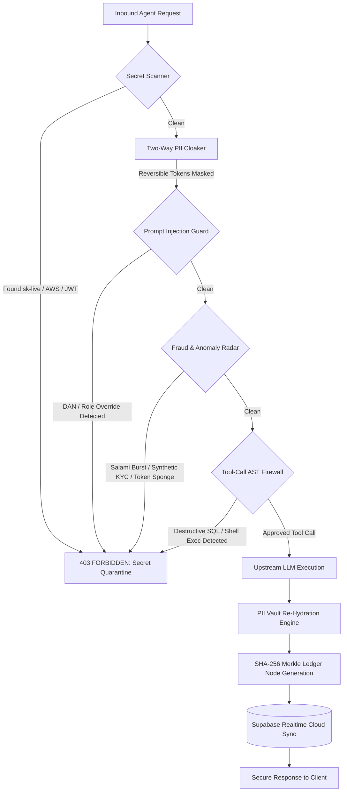

# 🛡️ TrustGate (Enclave)

> **Zero-Trust AI Security Gateway & Fraud Risk Control Plane for Autonomous Agents**  
> *Sub-millisecond wire-speed inspection, two-way reversible PII vaulting, tool-call AST firewalls, fraud velocity radar, universal email & URL verification, and cryptographic Merkle provenance.*

[](https://opensource.org/licenses/MIT)
[](https://github.com/Jathin-stack/TrustGate)
[](https://owasp.org/www-project-top-10-for-large-language-model-applications/)
[](https://github.com/Jathin-stack/TrustGate)
[](https://supabase.com)
[](https://vitejs.dev/)

---

## 📑 Table of Contents

- [Overview](#-overview)
- [Why TrustGate? (The Problem Space)](#-why-trustgate-the-problem-space)
- [System Architecture](#-system-architecture)
- [Core Protection Shields](#-core-protection-shields)
  - [1. Two-Way Reversible PII & Session Vault](#1-two-way-reversible-pii--session-vault)
  - [2. Autonomous Tool & Agent AST Firewall](#2-autonomous-tool--agent-ast-firewall)
  - [3. Fraud & Behavioral Anomaly Radar](#3-fraud--behavioral-anomaly-radar)
  - [4. Forensic Email & URL Phishing Radar](#4-forensic-email--url-phishing-radar)
  - [5. Prompt Injection & Jailbreak Neutralizer](#5-prompt-injection--jailbreak-neutralizer)
  - [6. Immutable SHA-256 Merkle Audit Ledger](#6-immutable-sha-256-merkle-audit-ledger)
- [Universal Email & URL Safety Checker](#-universal-email--url-safety-checker)
- [Operator Authentication Gate & Banani Theme](#-operator-authentication-gate--banani-theme)
  - [Zero-Trust Operator Authentication Gate](#zero-trust-operator-authentication-gate)
  - [Hover-Expanding Sidebar](#hover-expanding-sidebar)
  - [Operator Clearance Profile](#operator-clearance-profile)
  - [Enclave Gateway Settings](#enclave-gateway-settings)
- [1-Line Drop-In SDK Integration](#-1-line-drop-in-sdk-integration)
- [Getting Started & Local Setup](#-getting-started--local-setup)
- [Automated Verification Test Suite](#-automated-verification-test-suite)
- [REST API Reference](#-rest-api-reference)
- [Repository Structure](#-repository-structure)
- [Security & Compliance Posture](#-security--compliance-posture)
- [License](#-license)

---

## ⚡ Overview

**TrustGate (Enclave)** is an enterprise-grade AI security control plane that operates as a transparent, high-performance reverse proxy between autonomous AI agents and upstream LLMs (OpenAI, Anthropic, Gemini, LangChain, LlamaIndex).

While traditional Web Application Firewalls (WAFs) only inspect static HTTP parameters, TrustGate enforces **zero-trust guardrails directly on prompt tokens, tool invocations, and agent behaviors** with sub-millisecond overhead (**0.24ms benchmarked**, consuming less than 1% of application latency budgets).

```
[ Autonomous Agent / App ]
          │  (Standard OpenAI / HTTP Calls)
          ▼
┌────────────────────────────────────────────────────────────────────────┐
│                        TRUSTGATE ENCLAVE PROXY                         │
│                                                                        │
│  [1. Secret Quarantine] ──► [2. PII Reversible Vault]                  │
│                                    │                                   │
│  [4. Fraud & Anomaly Radar] ◄── [3. Prompt Injection Guard]            │
│         │                                                              │
│         ▼                                                              │
│  [5. Tool AST Firewall] ──► (Blocked: 403 / Sanitized: 200)            │
└────────────────────────────────────────────────────────────────────────┘
          │ (Sanitized Clean Prompt)
          ▼
   [ Upstream LLM ] (OpenAI / Anthropic / Local Model)
          │ (Model Response)
          ▼
┌────────────────────────────────────────────────────────────────────────┐
│  [Re-Hydrate PII Tokens] ──► [Merkle Cryptographic Hash & Supabase Log]│
└────────────────────────────────────────────────────────────────────────┘
          │ (Original PII restored for trusted client)
          ▼
   [ Final Client Response ]
```

---

## 🚨 Why TrustGate? (The Problem Space)

Autonomous agents granted tool execution rights introduce unprecedented attack surfaces that static rule engines and traditional cloud firewalls fail to protect against:

1. **Salami Fraud Attacks & High-Velocity Escalation**: Malicious agents triggering repeated micro-transactions ($9.80 × 43) or routing funds to unverified mixer wallets (`0x...`).
2. **Synthetic Identity & KYC Spoofing**: Coordinated account creation loops leveraging disposable burner domains (`@tempmail`, `@10minutemail`) and algorithmic invalid SSNs (`000-XX-XXXX`).
3. **Model & Token Arbitrage Abuse**: Resource-draining sponge loops, recursive prompt amplification, and prompt-injection-driven mass dataset distillation.
4. **Autonomous Agent Tool Poisoning (OWASP LLM08)**: Attackers coercing agents into executing destructive shell payloads (`rm -rf /`, `curl | sh`) or dropping production relational databases (`DROP TABLE users;`).
5. **PII & Secret Exfiltration (OWASP LLM06)**: Accidental leakage of customer SSNs, credit cards, or internal API keys (`sk-live...`) into multi-tenant LLM training logs.
6. **Social Engineering & Brand Phishing**: Executive display-name spoofing, coercive urgency cues ("wire immediately"), and deceptive URL host obfuscation.

---

## 🏗️ System Architecture

TrustGate’s inspection engine is built on deterministic heuristics, abstract syntax tree (AST) grammar parsers, regex token matchers, and cryptographic hashing—avoiding slow recursive model round-trips for gating decisions:



---

## 🛡️ Core Protection Shields

### 1. Two-Way Reversible PII & Session Vault
- **Zero Raw Data to Upstream Providers**: Automatically intercepts Social Security Numbers (SSNs), payment card PANs, email addresses, and phone numbers before they leave your perimeter.
- **Bi-Directional Hydration**: Masks entities with deterministic session tokens (`[REDACTED_EMAIL_1]`, `[REDACTED_CARD_1]`). Upstream LLMs complete reasoning over tokens; TrustGate re-hydrates true values strictly on the client return leg.
- **HIPAA & GDPR Ready**: Ensures patient data or cardholder PANs are never stored in third-party foundation model training sets.

### 2. Autonomous Tool & Agent AST Firewall
- **Deterministic SQL Grammar Guard**: Parses tool calls against an internal AST engine. Immediately blocks `DROP TABLE`, `TRUNCATE`, `ALTER TABLE`, and bulk `DELETE` attempts without `WHERE` clauses.
- **OS Shell Execution Sandbox**: Detects and neutralizes dangerous shell tokens (`rm -rf`, `mkfs`, `:(){ :|:& };:`, `chmod -R 777`, reverse bash shells).

### 3. Fraud & Behavioral Anomaly Radar
- **Section A: Financial Velocity & Salami Shield (`VEL-04`)**:
  - Sliding 60-second window tracking request frequency.
  - Crypto interceptor detecting unverified mixer routes and unauthorized wallet addresses.
  - Automatic refund fuse: any transaction exceeding **$500** is held for Human-In-The-Loop (HITL) approval.
- **Section B: Synthetic Identity & KYC Spoofing (`SYN-11`)**:
  - Rejects 52+ disposable burner domain providers (`@tempmail.com`, `@guerrillamail.com`, etc.).
  - Blocks invalid SSN schemas (`000-XX-XXXX`, `666-XX-XXXX`, `9XX-XX-XXXX`).
- **Section C: Token & Resource Arbitrage (`ARB-07`)**:
  - Detects token sponge loops and recursion attempts (`depth × 128`).
  - Strict daily token budget fuses (2,000,000 tokens / agent / day).
- **Section D: Social Engineering & Phishing Guard (`PHX-02`)**:
  - Analyzes coercive urgency signals (*"Immediate action required"*, *"Wire funds within 1 hour"*).
  - Flags executive display-name spoofing and cloaks sensitive password/OTP extraction attempts.

### 4. Forensic Email & URL Phishing Radar
- **Email Forensic Scanner**:
  - Heuristic SPF / DKIM / DMARC authentication parser.
  - Brand typosquatting and impersonation detection (`pаypal.com`, `arnazon-security.com`).
  - Actionable remediation runbooks with risk scores (0.0 to 1.0).
- **URL Deconstruction Engine**:
  - Detects raw IP host obfuscation (`http://192.168.1.1/login`), `@` delimiter credential redirects, and high-risk abuse TLDs (`.zip`, `.top`, `.tk`, `.buzz`).
  - Punycode & Cyrillic homograph lookup.

### 5. Prompt Injection & Jailbreak Neutralizer
- Neutralizes prompt injection, delimiter collision attacks (`<|im_start|>`, `system: override`), and "Do Anything Now" (DAN) evasion modes.

### 6. Immutable SHA-256 Merkle Audit Ledger
- Every transaction is cryptographically linked to the previous block via SHA-256:
  $$\text{Hash}_n = \text{SHA256}(\text{Block}_n \,||\, \text{Timestamp} \,||\, \text{PayloadHash} \,||\, \text{Hash}_{n-1})$$
- **Tamper Evidence**: One-click cryptographic verification of the entire audit chain.
- **Evidence Pack Export**: Download complete cryptographic proofs as verified JSON evidence packs for SOC 2, HIPAA, and PCI-DSS compliance audits.

---

## 🔍 Universal Email & URL Safety Checker

TrustGate includes an instant, zero-latency safety engine accessible both via REST API and the interactive dashboard:

```http
POST /api/v1/fraud/quick-check
Content-Type: application/json

{ "target": "support@paypa1-security.xyz" }
```

**Response:**
```json
{
  "success": true,
  "verdict": "UNSAFE",
  "badge": "MALICIOUS / HIGH RISK",
  "risk_score": 1.0,
  "category": "BRAND_TYPOSQUATTING_IMPERSONATION",
  "reasons": [
    "HIGH_RISK_TLD: Sender domain uses top-level domain '.xyz' with elevated abuse incidence.",
    "BRAND_TYPOSQUATTING_IMPERSONATION: Domain @paypa1-security.xyz mimics trusted authority 'paypal.com'."
  ]
}
```

### Coverage Matrix (13/13 Verified Scenarios)

| Input Sample | Detection Category | Verdict |
| :--- | :--- | :---: |
| `developer@apple.com` | Verified Enterprise Communication | ✅ **SAFE** |
| `user@gmail.com` | Clean Public Communication | ✅ **SAFE** |
| `fraudster@tempmail.com` | Disposable Burner Sender Domain | ❌ **UNSAFE** |
| `support@paypa1-security.xyz` | Brand Typosquatting / Character Substitution | ❌ **UNSAFE** |
| Coercive Phishing Email Body | Aggressive Urgency Cues & Malicious Links | ❌ **UNSAFE** |
| `https://google.com` | Verified Clean Authority | ✅ **SAFE** |
| `https://github.com/Jathin-stack/TrustGate` | Verified Clean Source Code Repository | ✅ **SAFE** |
| `http://192.168.1.104/login.php` | Direct IP Host Obfuscation (DNS Evasion) | ❌ **UNSAFE** |
| `https://paypal-account-verify.xyz/login` | Abuse TLD & Brand Phishing Mimicry | ❌ **UNSAFE** |
| `https://free-installer-tools.net/update.exe` | Drive-By Executable Malware Delivery | ❌ **UNSAFE** |
| `https://bit.ly/secure-login-3819` | Opaque URL Shortener (Blind Destination) | ⚠️ **SUSPICIOUS** |

---

## 🎨 Operator Authentication Gate & Banani Theme

The frontend is styled strictly after the [Banani Prototype](https://app.banani.co/prototype/bVIqX48dxQJI), using deep obsidian charcoal (`#09090b`), solar amber glows (`#F59E0B`), warm corals (`#F43F5E`), and emerald verification badges.

### Zero-Trust Operator Authentication Gate
- **Strict Cryptographic Enforcement**: Unauthenticated sessions are barred from accessing gateway controls.
- **Specific Error Pointing & Access Denial**:
  - **Unregistered Operator**: Highlights email input in red with `ERR_UNKNOWN_OPERATOR_DENIED`.
  - **Passphrase Signature Mismatch**: Highlights passphrase input in red with `ERR_CRYPTO_SIGNATURE_MISMATCH`.
  - **Disposable Email Burner**: Rejects temporary domains with `ERR_DISPOSABLE_DOMAIN_BLOCKED`.
  - **Registration Validation**: Enforces full name, organization, passphrase complexity (≥ 8 chars), and password confirmation match.
- **Automatic Redirection**: Upon clean verification, displays an approval card and automatically redirects the operator to `01 · Control Center`.
- **1-Click Demo Operators**: Instant one-click authentication for `Alex Chen (L4 Officer)` and `Sarah Kim (L3 SecOps)`.

### Hover-Expanding Sidebar
- Collapses to `w-[72px]` for full-width workspace density.
- Smoothly expands to `w-[280px]` on hover showing section labels and status indicators with **zero layout reflow**.
- Grouped into three distinct operator zones:
  - **Core Gateway**: `01 · Control Center`, `02 · Fraud Command`, `Email & URL Radar`
  - **Testing & Compliance**: `03 · Attack Sandbox`, `04 · Policy Matrix`, `05 · Merkle Ledger`
  - **Management & Clearance**: `Operator Profile`, `Gateway Settings`

### Operator Clearance Profile
- Displays security clearance banner (`L4 · ENCLAVE CRYPTO OFFICER`), TLS 1.3 tunnel status, and hardware key attestation.
- Cryptographic session public keys with one-click copy and instant key rotation.
- Role-Based Access Control (RBAC) permission grid and chronological security audit trail.

### Enclave Gateway Settings
- **Runtime Posture**: Fail-Closed vs Fail-Open switch, 20ms SLA latency ceiling, and reversible AES-256 vault toggle.
- **Model Proxy Routing**: Upstream endpoint configuration, Anthropic Claude fallback provider, and daily token fuses.
- **Incident Webhooks**: Real-time Slack and PagerDuty alert routing with severity filtering.
- **Key Rotation**: Master gateway secret rotation with automated 60-minute sunset grace period.

---

## 🔌 1-Line Drop-In SDK Integration

To protect any Python, Node.js, or LangChain agent, point the client's `baseURL` to TrustGate. **Zero model code rewrites required.**

### Node.js (OpenAI SDK)

```javascript
import OpenAI from 'openai';

// 1-Line change: Point client directly to TrustGate Enclave:
const openai = new OpenAI({
  apiKey: process.env.OPENAI_API_KEY,
  baseURL: 'http://localhost:5000/api/v1/gateway'
});

async function runAgent() {
  const response = await openai.chat.completions.create({
    model: 'gpt-4o',
    messages: [{ role: 'user', content: 'Process customer record: john@apple.com, SSN 000-12-3456' }]
  });

  console.log(response.choices[0].message.content);
}
```

### Python (OpenAI SDK / LangChain)

```python
from openai import OpenAI
import os

# 1-Line change: Point to TrustGate Enclave
client = OpenAI(
    api_key=os.environ.get("OPENAI_API_KEY"),
    base_url="http://localhost:5000/api/v1/gateway"
)

response = client.chat.completions.create(
    model="gpt-4o",
    messages=[{"role": "user", "content": "Query production database..."}]
)

print(response.choices[0].message.content)
```

---

## 🚀 Getting Started & Local Setup

### Prerequisites
- **Node.js**: v18.0.0 or higher
- **npm**: v9.0.0 or higher
- *(Optional)* **Supabase** account for real-time cloud telemetry

### 1. Clone & Install Dependencies

```bash
git clone https://github.com/Jathin-stack/TrustGate.git
cd TrustGate
npm install
```

### 2. Configure Environment

Copy the template:

```bash
cp .env.example .env
```

Configure `.env`:

```env
PORT=5000
NODE_ENV=development

# Master Gateway Secret Key
GATEWAY_SECRET_KEY=9f8e7d6c5b4a39281706f5e4d3c2b1a0e9f8d7c6b5a4938271605f4e3d2c1b0a

# Optional: Supabase Realtime Telemetry
VITE_SUPABASE_URL=https://your-project-id.supabase.co
VITE_SUPABASE_ANON_KEY=your_anon_key_here
SUPABASE_SERVICE_ROLE_KEY=your_service_role_key_here
```

### 3. Launch Development Servers

Start the backend API gateway:
```bash
node src/server/index.js
```
*(Runs on `http://localhost:5000`)*

In a separate terminal, start the Vite client application:
```bash
npm run dev
```
*(Runs on `http://localhost:3000`)*

### 4. Build for Production

```bash
npm run build
```

---

## 🧪 Automated Verification Test Suite

TrustGate includes comprehensive automated test suites covering each layer of defense:

```bash
# 1. Universal Email & URL Instant Safety Engine (13 Scenarios)
node test_quick_check.js

# 2. Complete End-to-End Test (Guardrails, SLA latency, Observability)
node test_e2e.js

# 3. Fraud Subsystem Tests (Velocity, Synthetic Identity, Token Arbitrage, Phishing)
node test_fraud_subsystem.js

# 4. Forensic Email & URL Radar Tests (Typosquatting, Headers, IP Obfuscation)
node test_email_url_fraud.js

# 5. Enterprise Capabilities Suite (Reversible PII, Merkle Proofs, SOC 2 Reports)
node test_showstoppers.js
```

**Benchmark Results:**
```
[STEP 2] Testing Zero-Trust Guardrails & Overhead...
✅ [403] OWASP LLM01 - Prompt Injection Guard       (Latency: 0.07ms < 20ms SLA)
✅ [200] OWASP LLM06 - Secret Credential Quarantine (Latency: 0.14ms < 20ms SLA)
✅ [200] OWASP LLM06 - PII Credit Card & SSN Vault  (Latency: 0.31ms < 20ms SLA)
✅ [403] OWASP LLM08 - Destructive SQL AST Defense  (Latency: 0.25ms < 20ms SLA)
✅ [403] OWASP LLM08 - Shell Sandbox Injection      (Latency: 0.19ms < 20ms SLA)
✅ [200] Clean Query Business Request               (Latency: 0.04ms < 20ms SLA)
```

---

## 📡 REST API Reference

| Method | Endpoint | Description |
|---|---|---|
| `POST` | `/api/v1/fraud/quick-check` | **Unified Safety Engine**: Inspects any email or URL and returns a definitive SAFE / UNSAFE verdict |
| `POST` | `/api/v1/gateway/chat` | Main drop-in reverse proxy endpoint (OpenAI wire-compatible) |
| `POST` | `/api/v1/gateway/inspect` | Raw inspection endpoint returning verdicts without upstream forwarding |
| `POST` | `/api/v1/fraud/email/analyze` | Forensic SPF/DKIM and email phishing body threat analyzer |
| `POST` | `/api/v1/fraud/url/analyze` | URL homograph, IP obfuscation, executable payload scanner |
| `GET` | `/api/v1/fraud/stats` | Aggregated fraud radar KPIs and repelled attack counters |
| `GET` | `/api/v1/fraud/radar` | Live real-time stream of intercepted fraud events |
| `GET` | `/api/v1/policies` | Fetches active compliance matrix and rule configurations |
| `POST` | `/api/v1/policies` | Updates runtime compliance thresholds and feature toggles |
| `GET` | `/api/v1/telemetry/stats` | Real-time aggregate telemetry stats and threat distributions |
| `GET` | `/api/v1/telemetry/audit-chain/verify` | Runs full cryptographic SHA-256 Merkle chain verification |

---

## 📁 Repository Structure

```
TrustGate/
├── src/
│   ├── client/                     # Vite + React 18 Frontend
│   │   ├── styles/
│   │   │   └── index.css           # Banani design tokens & keyframes
│   │   ├── TrustGateApp.jsx        # Complete dashboard, auth gate, profile & settings
│   │   ├── main.jsx                # Application root entry
│   │   └── supabaseClient.js       # Supabase Realtime client configuration
│   └── server/                     # Node.js Express Gateway Core
│       ├── config/                 # Environment and DB configs
│       ├── routes/
│       │   ├── gateway.js          # /chat & /inspect proxy routes
│       │   ├── fraud.js            # Email & URL fraud radar routes
│       │   ├── policies.js         # Compliance matrix routes
│       │   └── telemetry.js        # KPI & Merkle verification routes
│       ├── services/
│       │   └── engine/
│       │       ├── secretScanner.js     # API key & token quarantine
│       │       ├── piiCloaker.js        # Reversible session vault
│       │       ├── injectionGuard.js    # Prompt injection defense
│       │       ├── toolFirewall.js      # AST SQL & shell parser
│       │       ├── fraudDetector.js     # Velocity, Synthetic KYC, Arbitrage
│       │       ├── emailUrlDetector.js  # Email & URL forensic heuristic scanner
│       │       └── merkleTree.js        # Cryptographic audit hash engine
│       └── index.js                # Server entry point
├── test_e2e.js                     # End-to-end integration test suite
├── test_quick_check.js             # Universal email & URL safety test suite
├── test_fraud_subsystem.js         # Dedicated fraud radar test suite
├── test_email_url_fraud.js         # Forensic email & URL radar tests
├── test_showstoppers.js            # Enterprise compliance & Merkle proof tests
├── tailwind.config.js              # Custom palette colors & typography
├── vite.config.js                  # Frontend Vite bundler configuration
├── package.json                    # Project dependencies and scripts
├── .env.example                    # Environment variable template
└── README.md                       # Documentation
```

---

## 🔒 Security & Compliance Posture

| Framework | Coverage | Enforced Control |
|---|---|---|
| **OWASP LLM Top 10** | LLM01, LLM02, LLM06, LLM08 | Prompt injection blocking, secret quarantine, PII cloaking, tool firewalls |
| **HIPAA** | 45 CFR § 164.312 | PHI anonymization, 18 HIPAA identifier masking, audit trail logs |
| **PCI-DSS v4.0** | Req 3.4 & Req 10 | Primary Account Number (PAN) cloaking, $500 velocity cap, Merkle evidence |
| **SOC 2 Type II** | Trust Services Criteria (Security & Privacy) | Cryptographic immutable hash chain with automated verification proofs |

---

## 📄 License

Distributed under the **MIT License**. See `LICENSE` for details.

Developed with ❤️ for the next generation of safe, reliable autonomous AI agents.